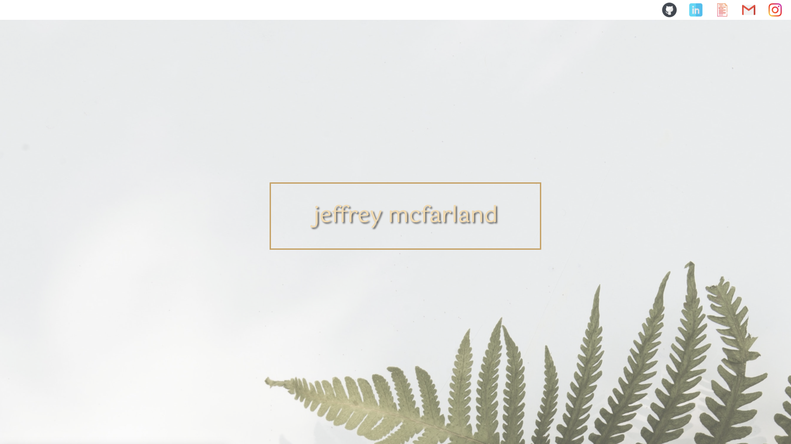

# 
React Portfolio

## About 

This is my same portfolio built as a React app with a server connection as well. My code from my original portfolio repository was brought in for most of the jsx, but I have refactored most of the page into components and created a scripts page to handle most of the javascript. 

***
## Table of Contents
1. [License](#license)
2. [Screenshots](#screenshots)
3. [Languages & Technologies](#languages-&-technologies)
4. [Contributing](#contributing)
5. [Contact Me](#contact-me)

***
## License

***
## Previews

<kbd></kdb>

***

***
## Languages & Technologies

* React
* HTML
* CSS
* Node
* Express
* JavaScript
* BootStrap
* Materialize

***
## Contributing

jeffreymcfarland

***
## Contact Me    

<kbd></kbd> 
* Email: <jlmcfarlandj@gmail.com>

